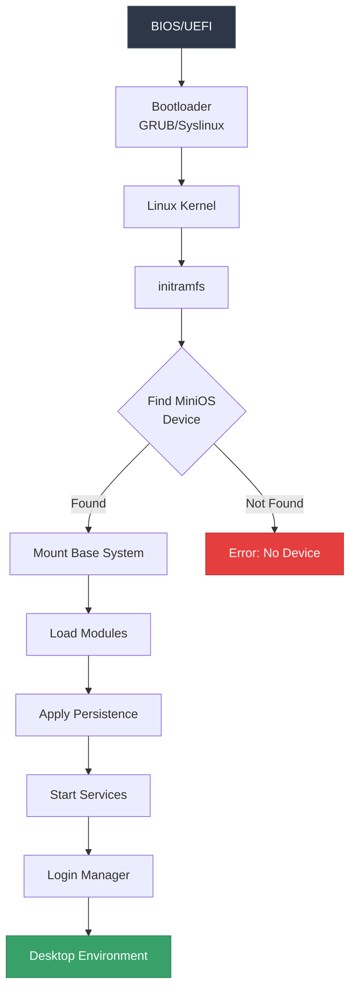
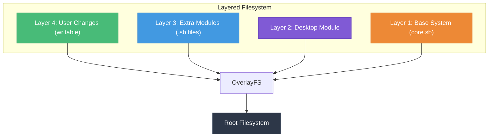
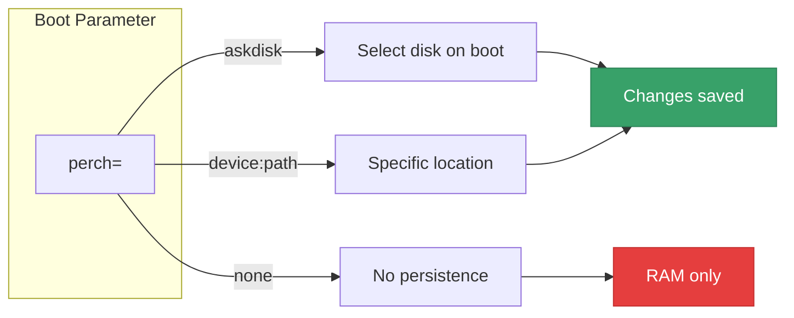
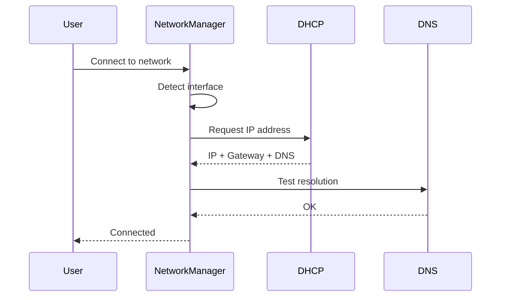
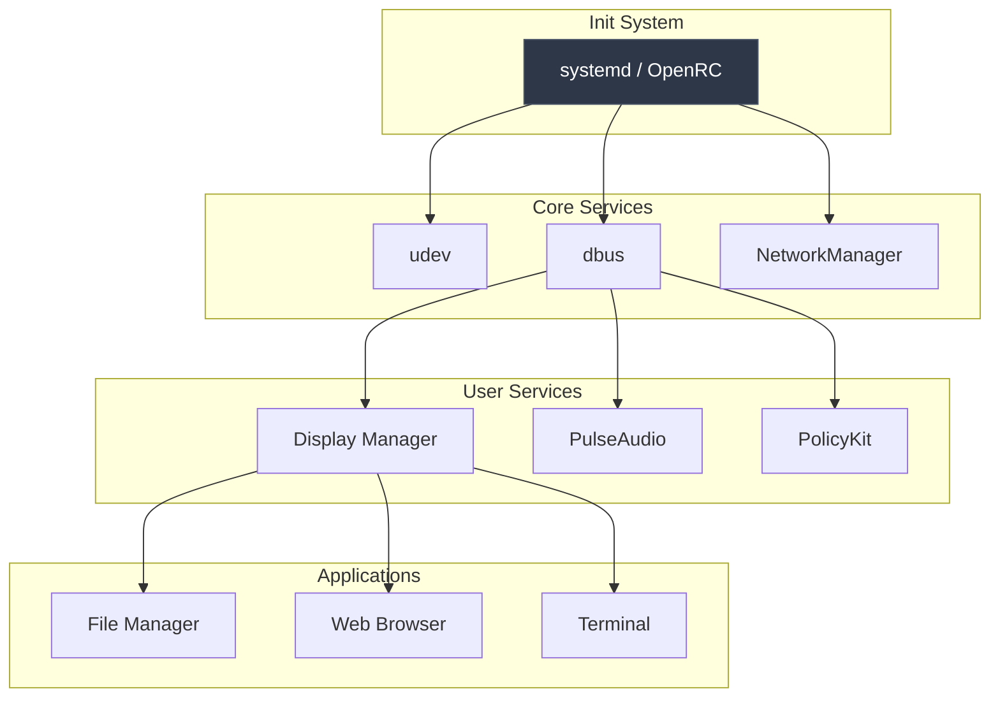
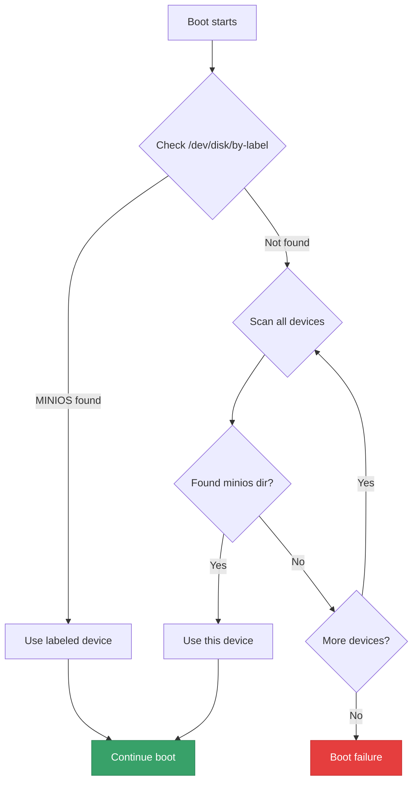

# MiniOS Architecture: How It Works

Understanding how MiniOS works under the hood can help you troubleshoot issues, customize your system, and contribute to the project. This article explains the core architecture using diagrams.

## Boot Process Overview

The MiniOS boot process is designed for speed and flexibility. Here's how it works:

## Module System

MiniOS uses a layered module system based on SquashFS and OverlayFS:

### Module Types

| Type | Extension | Purpose | Location |
|------|-----------|---------|----------|
| Core | `.sb` | Base system | `/minios/base/` |
| Optional | `.sb` | Extra software | `/minios/modules/` |
| Changes | dir | User modifications | `/minios/changes/` |

## Persistence Modes

MiniOS supports multiple persistence modes for different use cases:

### Persistence Options Comparison

| Mode | Speed | Persistence | USB Safe | Use Case |
|------|-------|-------------|----------|----------|
| RAM Only | ⚡⚡⚡ | ❌ | ✅ | Testing, Kiosk |
| Native | ⚡⚡ | ✅ | ⚠️ | Fixed installation |
| Changes Dir | ⚡⚡ | ✅ | ✅ | USB with changes |
| Encrypted | ⚡ | ✅ | ✅ | Secure portable |

## Network Configuration Flow

## System Services Architecture

## USB Boot Architecture

When booting from USB, MiniOS uses a special detection mechanism:

## Memory Layout

| Region | Purpose | Typical Size |
|--------|---------|--------------|
| Kernel | Linux kernel | 10-15 MB |
| Modules | Kernel modules | 50-100 MB |
| Initramfs | Boot environment | 30-50 MB |
| SquashFS Cache | Decompressed blocks | Dynamic |
| OverlayFS | File changes | Dynamic |
| Applications | Running programs | Variable |

## Conclusion

MiniOS's architecture is designed for:
- **Speed**: SquashFS compression with fast decompression
- **Portability**: Works from any bootable device
- **Flexibility**: Modular design allows customization
- **Reliability**: Read-only base system prevents corruption

Understanding these concepts will help you:
- Troubleshoot boot issues
- Create custom modules
- Optimize for your use case
- Contribute to MiniOS development

---

*Have questions about MiniOS internals? Check our [GitHub](https://github.com/minios-linux/minios-live) or ask in [Telegram](https://t.me/minios_chat)!*
